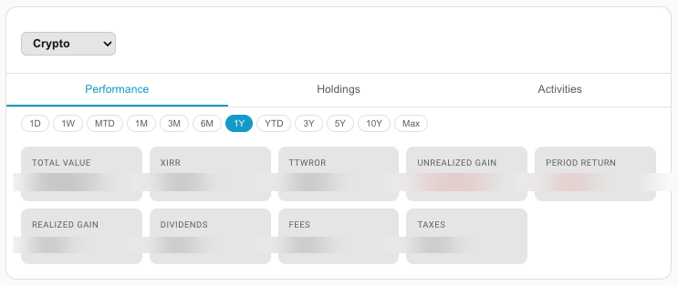
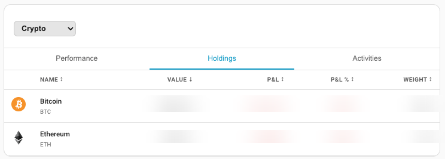
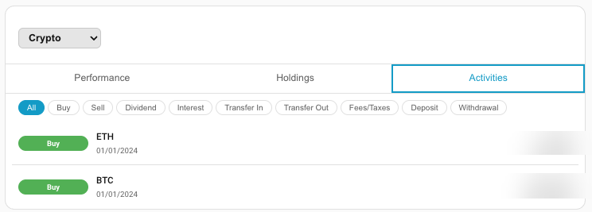

# Parqet Home Assistant Companion

[](https://github.com/hacs/integration)
[](https://github.com/cubinet-code/parqet-homeassistant-companion/releases)
[MIT License](LICENSE)

<p align="center">
  
</p>

A [Home Assistant](https://www.home-assistant.io/) Lovelace custom card that connects to your [Parqet](https://parqet.com) portfolio — displaying real-time performance metrics, holdings, and transaction history directly on your dashboard.

## Screenshots

| Performance | Holdings | Activities |
|---|---|---|
|  |  |  |

> **Note:** Screenshots coming soon — add the card to your dashboard and take your own!

---

## Features

- **Performance view** — Total value, XIRR, TTWROR, unrealized/realized gains, dividends, fees & taxes with configurable time intervals
- **Holdings view** — Current positions with market value, P&L (absolute and %), portfolio weight, and per-holding detail expansion
- **Activities view** — Full transaction history (buy, sell, dividend, interest, transfer, fees) with type filters and pagination
- **Multi-portfolio** — Switch between portfolios via an in-card selector
- **Theme-aware** — Adapts to your Home Assistant light/dark theme automatically
- **Dual data source** — Connect REST API (default) or Parqet MCP server

---

## Requirements

- Home Assistant 2023.7.0 or later
- A [Parqet](https://parqet.com) account

---

## Installation

### Via HACS (recommended)

> **Important:** If you previously added this repo with the wrong type (Template, Integration, etc.), remove it first and re-add it as **Dashboard**.

1. Open HACS → **⋮** (top-right menu) → **Custom repositories**
2. Paste `https://github.com/cubinet-code/parqet-homeassistant-companion`
3. Set **Type** to **Dashboard** ← must be exactly this (Lovelace frontend card)
4. Click **Add**
5. Search for **Parqet Home Assistant Companion** and install it
6. Reload Home Assistant

### Manual

1. Download `parqet-homeassistant-companion.js` from the [latest release](https://github.com/cubinet-code/parqet-homeassistant-companion/releases/latest)
2. Copy it to `<config>/www/parqet-homeassistant-companion.js`
3. Add a resource in **Settings → Dashboards → Resources**:
   - URL: `/local/parqet-homeassistant-companion.js`
   - Type: `JavaScript Module`
4. Reload Home Assistant

---

## Setup

### 1. Add the card

In any Lovelace dashboard, add a card and choose **Parqet Home Assistant Companion** (or use the YAML editor):

```yaml
type: custom:parqet-companion-card
```

### 2. Connect your Parqet account

The card will show a **Connect with Parqet** button. Clicking it opens a popup where you authorize access. Your access token is stored locally in your browser — nothing leaves your Home Assistant instance.

> **Note:** The OAuth redirect page is hosted at
> `https://cubinet-code.github.io/parqet-homeassistant-companion/callback.html`
> and is only used to relay the authorization code back to the card.

---

## Configuration

### Visual editor

The card includes a built-in visual editor — no YAML required for basic setup.

1. Add the card to your dashboard
2. Click the **pencil icon** to open the card editor
3. Select the **Config** tab — all settings are shown as dropdowns, toggles and text fields:

| Setting | What it does |
|---|---|
| Data Source | REST API (recommended) or MCP server |
| Portfolio ID | Lock to a specific portfolio, or leave blank for the in-card picker |
| Default View | Which tab opens first (Performance / Holdings / Activities) |
| View Layout | Show all tabs, or a single view |
| Default Time Interval | Starting interval for the performance chart |
| Currency Symbol | Symbol shown next to monetary values |
| Show holding logos | Toggle logo images in the holdings table |
| Compact mode | Denser row layout |
| Activities per page | How many transactions to load at once (10–500) |
| Parqet Connect Client ID | Advanced: use your own OAuth app registration |
| OAuth Redirect URI | Advanced: required when using a custom Client ID |

### YAML reference

```yaml
type: custom:parqet-companion-card

# Optional — which data source to use
data_source: "rest"          # "rest" (default) | "mcp"

# Optional — lock to a specific portfolio (omit to show a picker)
portfolio_id: "your-portfolio-id"

# Optional — view layout
view_layout: "tabs"          # "tabs" (default) | "single"
default_view: "performance"  # "performance" | "holdings" | "activities"

# Optional — performance view
default_interval: "1y"       # 1d | 1w | mtd | 1m | 3m | 6m | 1y | ytd | 3y | 5y | 10y | max

# Optional — activities view
activities_limit: 25         # items per page, 10–500

# Optional — display
currency_symbol: "€"
show_logo: true              # show holding logos
compact: false               # compact row density

# Advanced — use your own Parqet Connect app registration
# (leave blank to use the shared default, which works for most users)
# client_id: "your-client-id"
# redirect_uri: "https://your-callback-page/callback.html"
```

---

## Data Sources

| Source | Description |
|---|---|
| `rest` (default) | Calls the [Parqet Connect API](https://developer.parqet.com) directly |
| `mcp` | Calls the [Parqet MCP server](https://mcp.parqet.com) — same data, different transport |

Both sources expose identical portfolio data. The REST API is recommended for most users.

---

## Privacy & Security

- Authentication uses **OAuth 2.0 with PKCE** — no client secret is involved
- Your access token is stored in your browser's `localStorage` and never sent anywhere except to Parqet's API
- You can revoke access at any time in your [Parqet account settings](https://app.parqet.com)
- The card makes no requests to any server other than `connect.parqet.com` and (optionally) `mcp.parqet.com`

---

## Development

```bash
git clone https://github.com/cubinet-code/parqet-homeassistant-companion
cd parqet-homeassistant-companion
npm install

# Watch mode (dev server on :3000)
npm run dev

# Production build
npm run build
```

Copy `dist/parqet-homeassistant-companion.js` to your HA `config/www/` directory and add it as a resource.

---

## License

MIT — see [LICENSE](LICENSE)
