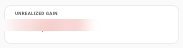

# Parqet Home Assistant Companion

[](https://github.com/hacs/integration)
[](https://github.com/cubinet-code/parqet-homeassistant-companion/releases)
[](LICENSE)

A [Home Assistant](https://www.home-assistant.io/) Lovelace custom card that connects to your [Parqet](https://parqet.com) portfolio — displaying real-time performance metrics, holdings, and transaction history directly on your dashboard.

## Screenshots

<table>
<tr>
<td width="50%"><b>Performance</b><br/></td>
<td width="50%"><b>Holdings</b><br/></td>
</tr>
<tr>
<td width="50%"><b>Activities</b><br/></td>
<td width="50%"><b>KPI card</b><br/></td>
</tr>
</table>

---

## Card types

| Card | Description |
|---|---|
| `custom:parqet-companion-card` | Full card with Performance, Holdings, and Activities tabs |
| `custom:parqet-kpi-card` | Compact single-metric tile — ideal for dashboards |

---

## Features

- **Performance view** — Total value, XIRR, TTWROR, unrealized/realized gains, dividends, fees & taxes with configurable time intervals
- **Holdings view** — Current positions with market value, P&L (absolute and %), portfolio weight, exchange info, and per-holding detail expansion
- **Activities view** — Full transaction history (buy, sell, dividend, interest, transfer, fees) with type filters, broker info, and pagination
- **KPI tile** — Single-metric card with optional secondary metric and vertical/horizontal layout, suitable for grid/sidebar dashboards
- **Multi-portfolio** — Switch between portfolios via an in-card selector
- **Theme-aware** — Adapts to your Home Assistant light/dark theme automatically
- **REST API** — Connects via the [Parqet Connect API](https://developer.parqet.com) (MCP server currently unavailable due to Parqet API limitation)

---

## Requirements

- Home Assistant 2023.7.0 or later
- A [Parqet](https://parqet.com) account

---

## Installation

### Via HACS (recommended)

> **Important:** If you previously added this repo with the wrong type (Template, Integration, etc.), remove it first and re-add it as **Dashboard**.

1. Open HACS → **⋮** (top-right menu) → **Custom repositories**
2. Paste `https://github.com/cubinet-code/parqet-homeassistant-companion`
3. Set **Type** to **Dashboard** ← must be exactly this (Lovelace frontend card)
4. Click **Add**
5. Search for **Parqet Home Assistant Companion** and install it
6. Reload Home Assistant

### Manual

1. Download `parqet-homeassistant-companion.js` from the [latest release](https://github.com/cubinet-code/parqet-homeassistant-companion/releases/latest)
2. Copy it to `<config>/www/parqet-homeassistant-companion.js`
3. Add a resource in **Settings → Dashboards → Resources**:
   - URL: `/local/parqet-homeassistant-companion.js`
   - Type: `JavaScript Module`
4. Reload Home Assistant

---

## Setup

### 1. Add the card

In any Lovelace dashboard, add a card and choose **Parqet Home Assistant Companion** or **Parqet KPI Card** (or use the YAML editor):

```yaml
type: custom:parqet-companion-card
# or:
type: custom:parqet-kpi-card
```

### 2. Connect your Parqet account

Open the card editor (pencil icon) — a **Connect** button appears at the top when you're not yet authenticated. Clicking it opens a popup where you authorize access. Your access token is stored locally in your browser — nothing leaves your Home Assistant instance. Both card types share the same token, so you only need to connect once.

> **Note:** The OAuth redirect page is hosted at
> `https://cubinet-code.github.io/parqet-homeassistant-companion/callback.html`
> and is only used to relay the authorization code back to the card.

### 3. Select a portfolio

After connecting, the card either loads your portfolio automatically (if you only have one) or shows a portfolio picker. To lock to a specific portfolio, set `portfolio_id` in the config.

---

## Configuration

### Visual editor

The card includes a built-in visual editor — no YAML required for basic setup.

1. Add the card to your dashboard
2. Click the **pencil icon** to open the card editor
3. All settings are grouped into collapsible sections:

| Section | Settings |
|---|---|
| *(top level)* | **Portfolio** (dropdown of your portfolios), Data Source |
| **Layout** | View Layout, Default View, Compact mode, Hide portfolio header |
| **Performance** | Show interval selector, Default Time Interval |
| **Holdings** | Show holding logos |
| **Activities** | Activities per page, Default activity filter |
| **Display** | Currency Symbol |
| **Advanced** | Custom Client ID, Custom Redirect URI |

> **Disconnect** — to unlink your Parqet account, open the card editor. The disconnect button is in the editor only (not on the card itself).

---

### YAML reference

```yaml
type: custom:parqet-companion-card

# Optional — lock to a specific portfolio (omit to show in-card picker)
portfolio_id: "your-portfolio-id"

# Optional — data source
data_source: "rest"          # "rest" (default) — MCP currently unavailable

# Layout
view_layout: "tabs"          # "tabs" (default) | "single"
default_view: "performance"  # "performance" | "holdings" | "activities"
compact: false               # denser row layout
hide_header: false           # hide portfolio name/picker (useful when portfolio is locked)

# Performance view
show_interval_selector: true # show interval picker on the card
default_interval: "1y"       # 1d | 1w | mtd | 1m | 3m | 6m | 1y | ytd | 3y | 5y | 10y | max

# Holdings view
show_logo: true              # show holding logos

# Activities view
activities_limit: 10         # activities to show, 1–25 (API fetches minimum 10 regardless)
default_activity_type: null  # null = "All" | buy | sell | dividend | interest |
                             #   transfer_in | transfer_out | fees_taxes | deposit | withdrawal

# Display
currency_symbol: "€"         # symbol shown next to monetary values

# Advanced — use your own Parqet Connect app registration
# Leave blank to use the shared default, which works for most users
# client_id: "your-client-id"
# redirect_uri: "https://your-callback-page/callback.html"
```

---

### Config examples

**Minimal — just works, shows portfolio picker:**
```yaml
type: custom:parqet-companion-card
```

**Locked to one portfolio, performance-first:**
```yaml
type: custom:parqet-companion-card
portfolio_id: "abc-123-def"
default_view: performance
default_interval: ytd
currency_symbol: "$"
```

**Holdings dashboard panel (compact, no tabs):**
```yaml
type: custom:parqet-companion-card
portfolio_id: "abc-123-def"
view_layout: single
default_view: holdings
show_logo: true
compact: true
currency_symbol: "€"
```

**Activities feed — dividend tracking:**
```yaml
type: custom:parqet-companion-card
portfolio_id: "abc-123-def"
view_layout: single
default_view: activities
activities_limit: 25
default_activity_type: dividend
compact: true
```

---

## Parqet KPI Card



A compact tile that shows one or two metrics from your portfolio with vertical or horizontal layout. Great for placing multiple KPIs side-by-side on a grid dashboard.

### Setup

Open the card editor after adding the card — use the **Connect** button to authorize Parqet (same shared token as the companion card). Then pick a portfolio, primary metric, and optionally a secondary metric and layout.

> **Note:** When you connect via either card editor (Companion or KPI), both cards share the same token — you only need to connect once.

### Available metrics

| Config value | What it shows |
|---|---|
| `total_value` | Current portfolio value |
| `period_return` | Return over the selected interval (%) |
| `xirr` | Internal rate of return (annualised %) |
| `ttwror` | Time-weighted rate of return (%) |
| `unrealized_gain` | Unrealised gain in the interval |
| `realized_gain` | Realised gain in the interval |
| `dividends` | Dividend income in the interval |
| `fees` | Fees paid in the interval |
| `taxes` | Taxes paid in the interval |

### YAML reference

```yaml
type: custom:parqet-kpi-card

# Optional — lock to a specific portfolio (omit to use first portfolio)
portfolio_id: "your-portfolio-id"

# Which metric to display (default: total_value)
kpi: "total_value"

# Optional — add a second metric below/beside the primary
# secondary_kpi: "xirr"

# Layout: "vertical" (default) stacks metrics, "horizontal" places them side-by-side
layout: "vertical"       # "vertical" (default) | "horizontal"

# Default time interval shown when card loads
default_interval: "1y"   # 1d | 1w | mtd | 1m | 3m | 6m | 1y | ytd | 3y | 5y | 10y | max
show_interval_selector: true  # show interval picker on the card

# Display
currency_symbol: "€"
data_source: "rest"      # "rest" (default) — MCP currently unavailable

# Advanced (optional — leave blank to use shared defaults)
# client_id: "your-client-id"
# redirect_uri: "https://your-callback-page/callback.html"
```

### Config examples

**Total portfolio value:**
```yaml
type: custom:parqet-kpi-card
kpi: total_value
default_interval: 1y
currency_symbol: "€"
```

**XIRR year-to-date:**
```yaml
type: custom:parqet-kpi-card
portfolio_id: "abc-123-def"
kpi: xirr
default_interval: ytd
```

**Dividends this year:**
```yaml
type: custom:parqet-kpi-card
portfolio_id: "abc-123-def"
kpi: dividends
default_interval: ytd
currency_symbol: "€"
```

**Total value with XIRR, horizontal layout:**
```yaml
type: custom:parqet-kpi-card
kpi: total_value
secondary_kpi: xirr
layout: horizontal
default_interval: ytd
currency_symbol: "€"
```

---

## Data Source

The card uses the [Parqet Connect API](https://developer.parqet.com) (`rest`) to fetch portfolio data. The MCP server option (`mcp`) is currently unavailable due to a Parqet API limitation.

---

## Privacy & Security

- Works on both **HTTP and HTTPS** Home Assistant setups (pure-JS SHA-256 fallback for non-secure contexts)
- Authentication uses **OAuth 2.0 with PKCE** — no client secret is involved
- Your access token is stored in your browser's `localStorage` and never sent anywhere except to Parqet's API
- You can revoke access at any time in your [Parqet account settings](https://app.parqet.com)
- The card communicates only with `connect.parqet.com` (via a CORS proxy at `parqet-token-proxy.oliver-f26.workers.dev`)

---

## Development

```bash
git clone https://github.com/cubinet-code/parqet-homeassistant-companion
cd parqet-homeassistant-companion
npm install

# Watch mode (dev server on :3000)
npm run dev

# Production build
npm run build
```

Copy `dist/parqet-homeassistant-companion.js` to your HA `config/www/` directory and add it as a resource.

---

## License

MIT — see [LICENSE](LICENSE)
